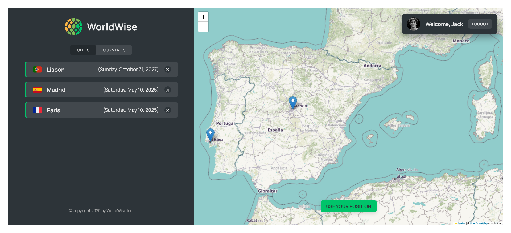

# WorldWise - Track Your Global Adventures

WorldWise is a React application that allows users to track and manage cities they've visited around the world. The app provides an interactive map interface where users can mark cities they've visited, add notes about their experiences, and keep a visual record of their global adventures.

## Features

- Interactive Map : Visualize all your visited cities on an interactive map powered by Leaflet
- City Management : Add, view, and delete cities from your personal travel log
- Geolocation : Use your current location to quickly add cities you're currently visiting
- Travel Notes : Add personal notes and memories for each city you visit
- Wikipedia Integration : Quick access to Wikipedia information about each city
- Responsive Design : Works on both desktop and mobile devices

## Project Structure

The application is built with React and uses the following key technologies:

- React : Frontend library for building the user interface
- React Router : For navigation and routing within the application
- Context API : For state management across components
- Leaflet/React-Leaflet : For the interactive map functionality
- CSS Modules : For component-specific styling
- JSON Server : For a mock backend to store city data

## Getting Started

### Prerequisites

- Node.js (v14 or higher recommended)
- npm or yarn

### Installation

1. Clone the repository
   git clone https://github.com/mahmoud1mandour/worldwise.git
   cd WorldWise

2. Install dependencies
   npm install

3. Start the JSON server (in a separate terminal)
   npm run server

4. Start the development server
   npm run dev

## Usage

- View Cities : Click on city markers on the map to see details about places you've visited
- Add City : Click anywhere on the map to add a new city to your collection
- Delete City : Remove cities you no longer want to track
- Use Current Location : Click the "Use your position" button to center the map on your current location

## Acknowledgments

- React
- React Router
- Leaflet
- React Leaflet
- JSON Server

